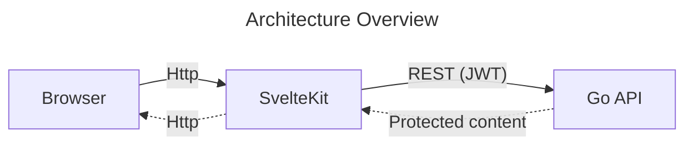
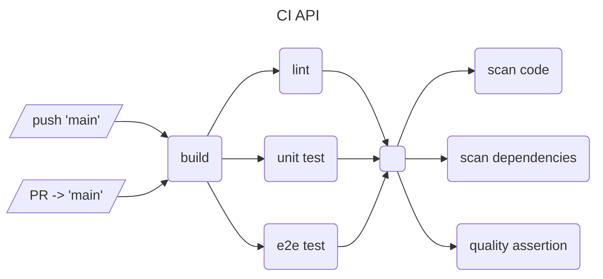
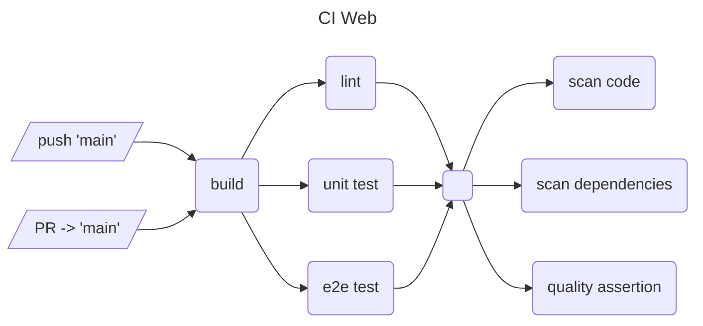
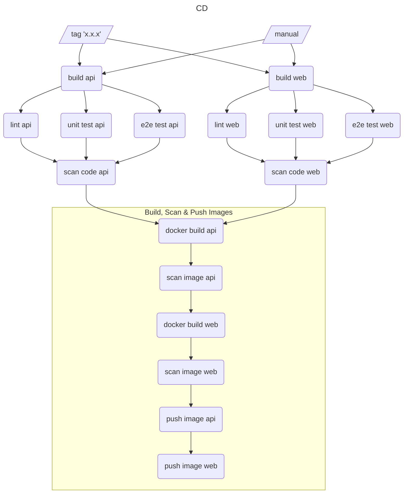
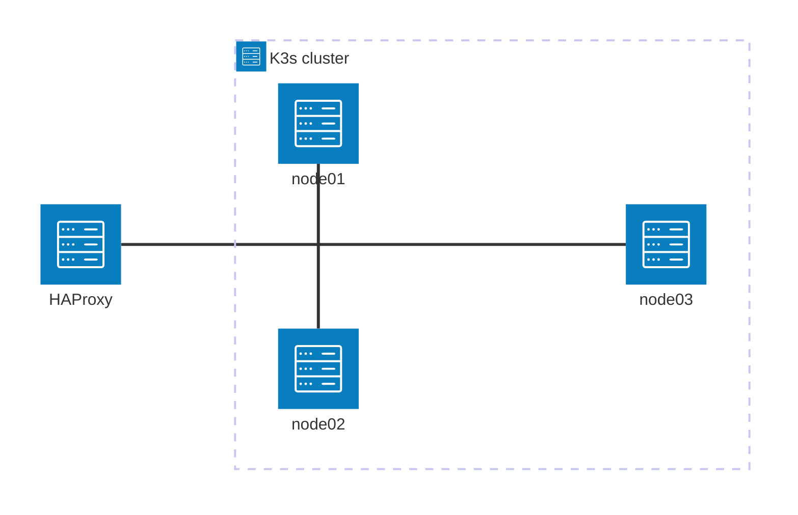
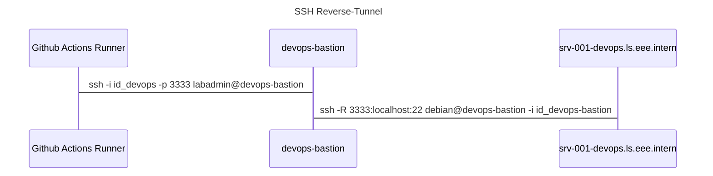
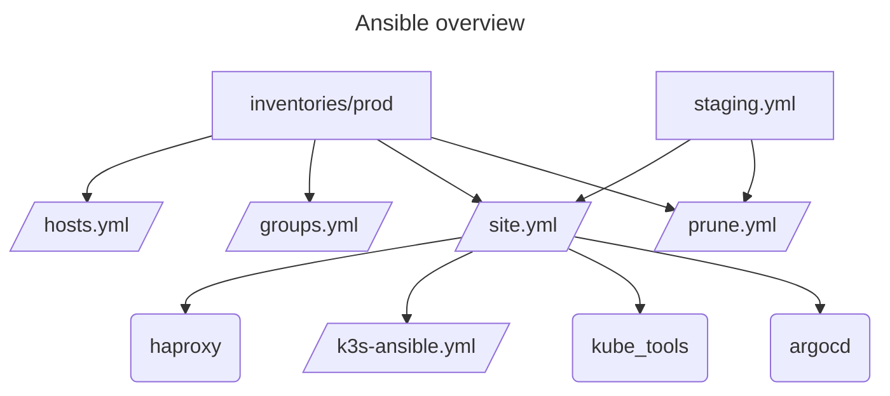

# DevOps - Group 08 [](https://github.com/ruegerj/devops/actions/workflows/sync-docs.yaml)

Members:

* Andreas Affentranger
* Jan Rüger
* Laurin Scholtysik
* Mirco Stadelmann

VMs:

* devops-bastion (83.228.209.199)
* srv-001.devops.ls.eee.intern
* srv-019.devops.ls.eee.intern
* srv-022.devops.ls.eee.intern
* srv-023.devops.ls.eee.intern

## Table of contents

- [Project Idea & Tools](#project-idead--tools)
- [Prerequisites & Setup](#prerequisites--setup)
  - [Local Workspace](#local-workspace)
  - [Git Workflow](#git-workflow)
  - [Docker Containers](#docker-containers)
- [Applications](#applications)
  - [REST API](#rest-api)
  - [Web Frontend](#web-frontend)
- [Pipelines](#pipelines)
  - [Continous Integration - API](#continous-integration---api)
  - [Continous Integration - Web](#continous-integration---web)
  - [Continous Deployment](#continous-deployment)
- [Secure Development Lifecycle](#secure-development-lifecycle)
  - [Dependency Scanning](#dependency-scanning)
  - [Code Analysis](#code-analysis)
  - [Container Scanning](#container-scanning)
  - [Credential Scanning](#credential-scanning)
- [Miscellaneous](#miscellaneous)
  - [GitLab Docs Sync](#gitlab-docs-sync)

External
  - [SonarQube - API](https://sonarcloud.io/project/overview?id=ruegerj_devops_api)
  - [SonarQube - Web](https://sonarcloud.io/project/overview?id=ruegerj_devops_web)

## Project Idea & Tools

**Application**

Dummy app that displays some information fetched from a private REST api.

- [X] Frontend - SvelteKit
- [X] Backend - Go REST API
- [ ] (Database - PostgreSQL) optional as extension

**DevOps Features**

- [X] CI Pipeline (GitHub Actions)
    - [X] Build
    - [X] Lint
    - [X] Test
    - [X] Static Vulnerability Analysis (Snyk)
    - [X] Static Code Quality / Test Coverage Analysis (SonarQube)

- [ ] CD Pipeline (Github Actions)
    - [X] Build
    - [X] Docker Image Build
    - [X] Image Scan (Snyk)
    - [X] Image Push (GitHub Container Registry)
    - [ ] (ArgoCD Sync)

- [X] K8S or K3S Hosting
- [X] ArgoCD for Deployments
- [ ] Credential Vault (Hashicorp Vault?)
- [X] SSH Reverse Tunnel
- [X] Configuration as Code (TerraForm + Ansible?) -> Desaster Recovery

**Extensions**

- [ ] New feature with toggle (feature flag)
- [ ] Database with automated backup
- [ ] Database with schema change

## Prerequisites & Setup

### Local Workspace

In order work on this repo locally, one needs the following tools:

- [Go](https://go.dev/) (v1.25)
- [golangci-lint](https://golangci-lint.run/) (>= v2.5.0)
- [Task](taskfile.dev) (v3)
- [Docker](https://www.docker.com/)
- [pnpm](https://pnpm.io/) (v10.x)
- [ansible](https://docs.ansible.com/)
- [ansible-lint](https://ansible.readthedocs.io/projects/lint/installing/#installing-the-latest-version) (python3 and pip required)

Recommended but not mandatory:

- [act](https://github.com/nektos/act)
- [openssl](https://openssl-library.org/) (if you want to generate JWTs by hand)
- [Vagrant](https://developer.hashicorp.com/vagrant)
- [libvirt](https://libvirt.org/) (Presume you alread have a virtualization platform like QEMU)
- [gocovmerge](https://pkg.go.dev/github.com/wadey/gocovmerge) (if you want to generate api test coverage reports)

For starting the application locally, testing, linting, or any other automations [Task](taskfile.dev) is used as a modern cross-platform Make
alternative. You can run task cmd's either in the repository root or in the dedicated subdirectories of the applications:

```bash
# start the api (cwd: ./)
task api:run

# start the api (cwd: ./api)
task run

# use: task --list-all for discovery of other cmd's
```

> All commands are written with unix systems in mind (Linux & Mac). If you are on Windows - try using a WSL instance if you are facing issues.

### Git workflow

The workflow should be pragmatic and enable productivity, however the following guardrails apply:

- every meaningful change should be done in a dedicated feature branch
- every feature branch should be either _squash-merged_ or _rebased_ back onto `main`
- every meaningful change should be peer-review via pull-request
- CI should be passing before a change gets onto `main`

### Docker Containers

The release pipeline will build, tag and push two docker images to the GitHub Container Registry. One for the api and one for
the web frontend:

- [api:latest](https://github.com/ruegerj/devops/pkgs/container/devops%2Fapi)
- [web:latest](https://github.com/ruegerj/devops/pkgs/container/devops%2Fweb)

During the build process the JWT_KEY and matching ACCESS_TOKEN are injected as build arguments into the respective docker images.

Note: JWT_KEY is defined as a github secret.

**Running the containers**
- Backend
  - Forward port 3000 to the host system.
- Frontend
  - Forward port 4173 to the host system.
  - Set API_BASE_URL to the backend URL (http://host.docker.internal:3000)
  - Note: http://localhost:3000 does not work as with this the container uses its INTERNAL localhost


You can run the containers with the following commands after loggin into ghcr.io with username and token:
```bash
docker pull ghcr.io/ruegerj/devops/api:latest
docker pull ghcr.io/ruegerj/devops/web:latest

docker run -d --name frontend -e API_BASE_URL=http://host.docker.internal:3000 -p 4173:4173 ghcr.io/ruegerj/devops/web:latest
docker run -d --name backend -p 3000:3000 ghcr.io/ruegerj/devops/api:latest
```

## Applications

The following diagram gives a brief overview on the application architecture. For more details see the corresponding sub sections.



### REST API

The REST API is written in Go. It features one main endpoint holding a "secret" value which can only be accessed when authenticated.

**Configuration:**

All configuration options are supplied as environment variables. When running the app locally via _Task_, they are automatically
supplied from the `.env` file. One for development purposes can be generated using the following command:

```bash
task generate:env
```

The following variables need to be set for the app to function properly:

| Key     | Description                                                       | Default value (Docker) |
| ------- | ----------------------------------------------------------------- | ---------------------- |
| HOST    | holds the hostname which the server listens on                    | 0.0.0.0                |
| PORT    | holds the TCP port number the server listens on                   | 3000                   |
| JWT_KEY | holds the symmetric signing key used to verify the JWT signatures | _none_                 |

**Endpoints:**

- `GET /health` - Indicates if the application is up and running
  - Authentication: _none_
  - Sample response:
    ```json
    {
      "status": "healthy",
      "timestamp": 1759777840
    }
    ```
- `GET /api/secret` - Holds secret value, only to be accessed by authenticated requests
  - Authentication: _Bearer token_ (JWT, HS256 symmetrically signed)
  - Sample request:
    ```bash
    curl --request GET \
      --url http://localhost:3000/api/secret \
      --header 'authorization: Bearer <jwt>'
    ```
  - Sample response:
    ```json
    {
      "message":"Some text",
      "number": 27
    }
    ```

**Tests:**

Most of the app's code is tested using unit tests. They live right next to their implementation in `x_test.go` files and are usually scoped in
their own testing module.

End-to-end (e2e) tests are located under _tests/e2e_. Before they are executed, the complete app is bootstrapped as [testcontainer](https://testcontainers.com/).
To be able to distinguish these tests from the unit tests, they must have the [build tag](https://pkg.go.dev/go/build#hdr-Build_Constraints) `e2e`.

In order to run the tests locally, use the following commands:

```bash
task test # both unit & e2e
task test:unit # unit tests only
task test:e2e # e2e tests only
```

**Coverage**

In order to generate a test coverage report (and display it conditionally), use the following command:

```bash
task test:cov show=true
```

Both unit & e2e tests run with an instrumented go binary, that dumps it's coverage data on graceful shutdown. The instrumentation
is performed by the go sdk itself. For the e2e testcontainer image the instrumentation is enabled using the environment variable
_INSTRUMENT_BINARY_.

The combined coverage report can be found in `bin/cov.out`. For CI runs this report is uploaded as artifact (_api-coverage-report_
) and held for 7 days.

### Web Frontend

The frontend is built using [SvelteKit](https://svelte.dev/docs/kit/introduction) as meta framework. It renders the UI and makes
authenticated calls to the [REST Api](#rest-api) in order to fetch data.

**Configuration:**

All configuration options are supplied as environment variables. When running the app locally, they are automatically supplied from
the `.env` file. One for development purposes can be generated using the following command:

```bash
task generate:env
```

> Note: the `.env` file of the api must already be present before running the command above

The following variables need to be set for the app to function properly:

| Key          | Description                                                        | Default value (Docker) |
| ------------ | ------------------------------------------------------------------ | ---------------------- |
| NODE_ENV     | holds the environment type the server should run in                | production             |
| ORIGIN       | holds the URL the application should listen on                     | http://localhost:4173  |
| PORT         | holds the TCP port number the server listens on                    | 4173                   |
| API_BASE_URL | holds the base url pointing to the api instance                    | _none_                 |
| ACCESS_TOKEN | holds the JWT access token used for authentication against the api | _none_                 |

**Endpoints:**

- `GET /api/secret` - Proxy for the same endpoint provided by the api (request will be enriched with private access token)
  - Authentication: _none_
  - Sample request:
    ```bash
    curl --request GET \
      --url http://localhost:5173/api/secret
    ```
  - Sample response: see [API > _Endoints_](#rest-api)

**Routes:**

- `/` - Displays the UI of the application
  - Authentication: _none_

**Tests:**

The app's code is tested using unit tests on component level. However due to the very limited functionality which is located in
the frontend their amount is very limited. In the case that project grows the testing infrastructure ([vitest](https://vitest.dev/)
) can be built uppon and extended with additional tests.

End-to-end (e2e) tests can be found in the _e2e_ directory. Here [Playwright](https://playwright.dev/) is used to test the actual
site for multiple headless browsers. In order to test all functionality, a complete api instance gets spun up using a
[testcontainer](https://testcontainers.com/).

In order to run the tests locally, use the following commands:

```bash
task test # both unit & e2e
task test:unit # unit tests only
task test:e2e # e2e tests only
```

> Before you execute e2e tests for the first time, make sure to run this command:
> ```bash
> pnpm dlx playwright install
> ```

**Coverage:**

In order to generate a test coverage report (and display it conditionally), use the following command:

```bash
task test:cov show=true
```

Both unit & e2e tests use [istanbul](https://istanbul.js.org/) for instrumenting the build output for coverage data collection.
The instrumentation is enabled using the environment variable _USE_PLUGIN_ISTANBUL_. For instrumenting the clientside files the
standard [vite](https://vite.dev/) build is used (with the corresponding plugin). The serverside files are explicitly instrumented
post-build using [babel](https://babeljs.io/). Their coverage is dumped uppon a graceful server shutdown.

The combined coverage report can be found in `coverage/combined/lcov.info`. For CI runs this report is uploaded as artifact
(_web-coverage-report_) and held for 7 days.

## Pipelines

### Continous Integration - API



The pipeline runs for every _push_ and _pull request_ targeting the `main` branch, which is holding changes in the `api`
directory. It features the following steps:

- **build** - Builds the entire codebase in order to find any compilation errors.
- **lint** - Statically checks the codebase for potential quality flaws using [golangci-lint](https://golangci-lint.run/)
- **unit test** - runs all unit tests
- **e2e test** - runs all e2e tests against a testcontainer instance of the app (see _Tests_ section of [API](#rest-api))
- **scan code** - runs static vulnerability scans using [Snyk](https://snyk.io/)
  -> results are uploaded as [GitHub code scanning alerts](https://docs.github.com/en/code-security/code-scanning/managing-code-scanning-alerts/about-code-scanning-alerts)
- **scan dependencies** - runs analysis for vulnerable dependency versions using [Snyk](https://snyk.io)
- **quality assertion** - collects test coverage and runs static code quality checks using [SonarQube](https://www.sonarsource.com/products/sonarqube/)
  -> coverage report is uploaded as workflow artefact

### Continous Integration - Web



The pipeline runs for every _push_ and _pull request_ targeting the `main` branch, which is holding changes in the `web`
directory. It features the following steps:

- **build** - Builds the entire codebase in order to find any compilation errors.
- **lint** - Statically checks the codebase for potential quality flaws using [eslint](https://golangci-lint.run/) & SvelteKit
linter. Additionaly it checks the format of every file using [prettier](https://prettier.io/).
- **unit test** - runs all unit tests using [vitest](https://vitest.dev)
- **e2e test** - runs all e2e tests using [Playwright](https://playwright.dev/) (see _Tests_ section of [Web](#web-frontent))
- **scan code** - runs static vulnerability scans using [Snyk](https://snyk.io/)
  -> results are uploaded as [GitHub code scanning alerts](https://docs.github.com/en/code-security/code-scanning/managing-code-scanning-alerts/about-code-scanning-alerts)
- **scan dependencies** - runs analysis for vulnerable dependency versions using [Snyk](https://snyk.io)
- **quality assertion** - collects test coverage and runs static code quality checks using [SonarQube](https://www.sonarsource.com/products/sonarqube/)
  -> coverage report is uploaded as workflow artefact


### Continous Deployment



The pipeline runs for every created tag (`x.x.x`). It runs all steps from the CI-piplines of both applications (see corresponding
chapters for more details) in parallel in  order to ensure the codebase is in a sane state. Afterwards the following steps are
executed to create, scan & deploy the Docker images for the new release:

- **docker build api** - builds the Docker image for the api backend
  -> secrets are injected into the image using build args
- **scan image api** - scans the freshly built api image using [Snyk](https://snyk.io)
- **docker build web** - builds the Docker image for the web frontend
  -> secrets are injected into the image using build args
- **scan image web** - scans the freshly built web image using [Snyk](https://snyk.io)
- **push image api** - pushes the api image to the [GitHub container registry](https://github.com/ruegerj/devops/pkgs/container/devops%2Fapi)
  -> the image is taged with the version from the git tag & `latest`
- **push image web** - pushes the web image to the [GitHub container registry](https://github.com/ruegerj/devops/pkgs/container/devops%2Fapi)
  -> the image is taged with the version from the git tag & `latest`

> [!NOTE]
> Due to some reliability issues, SonarQube analyses are excluded from the CD pipeline so that they do not block deployments.


### Continous Integration - Infrastructure
Upon every _push_ or _pull request_ targeting the `main` branch, a static linter (ansible-lint) is run against all Ansible playbooks, detecting potential formatting issues and quality flaws.

## Infrastructure
The following diagram gives a brief overview of the infrastructure setup the application is running on:



At the heart of the environment is a three node K3s cluster configured in a High Availability (HA) setup via [etcd](https://etcd.io/). It's resposible for hosting the application and all supporting services. For ingress the cluster uses a combination of ServiceLB and [Traefik](https://traefik.io/traefik). Entrypoints to both, the K3s API and Ingress controller are exposed as a single IP via  a [HAProxy](https://www.haproxy.org/) loadbalancer infront of the cluster.

> Note: In a ideal world atleast two loadbalancer e.g. HAProxy would be deployed in a HA setup, preventing the introduction of a new Single Point of failure (SPF). Another approach would be to use on cluster services like [MetalLB](https://metallb.io/installation/) and [kube-vip](https://kube-vip.io/) to introduce floating IPs and thus eliminating SPFs. In order to keep the infrastructure relatively simple and rather focusing on a broader set of devops topics, it was decided that in this particular case, having a single node loadbalancer at the expense of introducing a new SPF is acceptable.

### Network Access for Github Actions
In order to allow access to the Enterprise Lab VMs from the GitHub Action pipelines without the need of Pulse Secure VPN, a SSH reverse tunnel from `srv-001-devops.ls.eee.intern` to a bastion host (`devops-bastion`) located at a public cloud provider was estabilished.



### Automated infrastructure deployment via Ansible
Students were given four plain debian 12 (bookworm) VMs to deploy there infrastructure.
In order to prepare the infrastructure needed [Ansible](https://docs.ansible.com/) was used as a Infrastructure as Code (IaC) tool, enabeling fast and declarative provisioning aswell as rebuilding capabilities in case of a Disaster Recovery (DR) scenario. 
The diagram below gives quick overview of the playbook used for provisioning:



- **staging.yml** - inventory for staging environment
- **inventories/prod** - inventory for production environment
  - **hosts.yml** - all hosts with information to find the correct ssh-keys
  - **groups.yml** - group to hosts in hosts.yml (seperated for easier management)
- **site.yml** - main playbook orchestrating the provisioning
- **prune.yml** - playbook for uninstalling all ressources
- **haproxy** - role responsible for installing and configuring haproxy
- **k3s-ansible** - imported playbook from [k3s-ansible](https://github.com/k3s-io/k3s-ansible) responsible for provisioning the K3s HA cluster
- **kube_tools** - role for setting up [kubectl](https://kubernetes.io/docs/reference/kubectl/), [helm](https://helm.sh/) aswell as the needed Python libraries for ansible to interact with the K3s cluster
- **argocd** - role for deploying [argo-cd](https://argo-cd.readthedocs.io/en/stable/) to the K3s cluster

#### SSH Setup

Every host needs to have a dedicated user ansible with root privileges and a ssh key stored on the mgmt server to connect to the given host. Every host in ```inventories/prod/hosts.yml``` is linked with it's ssh key file.

```
all:
    srv-019.devops.ls.eee.intern:
      ansible_host: srv-019.devops.ls.eee.intern
      ansible_user: ansible
      ansible_ssh_private_key_file: /home/ansible/.ssh/ansible@srv-019
```

```
ansible@srv-001:~/.ssh$
.ssh/
├── ansible@srv-019
├── ansible@srv-019.pub
├── ansible@srv-022
├── ansible@srv-022.pub
├── ansible@srv-023
├── ansible@srv-023.pub
└── known_hosts
```

**Tests:**

For e2e testing of the Ansible playbooks a staging environment using [Vagrant](https://developer.hashicorp.com/vagrant) VMs can be deployed locally.

In order to initialize all needed dependencies for the testbed run (first time only):

```bash
task infra:generate:env # generates environment variables needed for the deployment
task infra:generate:key # generates ssh-keypair used to connect to the staging VMs
```

The test VMs can then be deployed via:

```bash
task infra:stage:up 
```

The `site.yml` playbook will automatically be run against the test VMs. Thus allowing developers to verify that the playbooks are working as desired.

After a change to the ansible roles or playbook:

```bash
task infra:stage:rerun
```

Can be executed, to rerun the playbook against the staging environment.

After finishing testing or if a new testrun with clean VMs is desired, the existing staging environment can be wiped using:

```bash
task infra:stage:down
```

### Workload deployment via ArgoCD
After initial infrastructure setup via Ansible, ArgoCD is used inorder to deploy K3s cluster workloads.
lorem ipsum
## Secure Development Lifecycle

In order to create a complete _Secure Development Lifecyle (SDLC)_ the platform [Snyk](https://snyk.io) is used in combination with
GitHub. Within GitHub all security findings of Snyk are pushed to the [Code Scanning](https://docs.github.com/en/code-security/code-scanning/managing-code-scanning-alerts/about-code-scanning-alerts) platform.

### Dependency Scanning

Runs in CI-pipelines for [web](#continous-integration---web) & [api](#continous-integration---api)

In order to scan for vulnerable dependencies [Snyk Open Source](https://snyk.io/product/open-source-security-management/) is used.
It scans the the _pnpm-lock.yaml_ (for web) and the _go.mod_ (for api) for dependency version that have reported vulnerabilites. When vulnerable dependencies are found, the workflow fails in order to prevent them getting used for a release. To handle false
positives or vulnerabilites that don't have to be fixed immediately - time based ignore rules can be configured using the [Snyk CLI](https://docs.snyk.io/developer-tools/snyk-cli/scan-and-maintain-projects-using-the-cli/ignore-vulnerabilities-using-the-snyk-cli).

### Code Analysis

Runs in CI-pipelines for [web](#continous-integration---web) & [api](#continous-integration---api)

In order to statically analyse (SAST) the code for vulnerabilites [Snyk Code](https://snyk.io/product/snyk-code/) is used. To define
app specific path exclusions (e.g. test files) a _.snyk_ file in the respective subfolder is used - either by hand or using the
[Snyk CLI](https://docs.snyk.io/developer-tools/snyk-cli/scan-and-maintain-projects-using-the-cli/snyk-cli-for-snyk-code/exclude-directories-and-files-from-snyk-code-cli-tests).
Due to the semantic code analysis of Snyk findings cannot simply be ignored using a specific comment. When faced with false
positives use the [web-app](https://app.snyk.io) to ignore them properly.

### Container Scanning

Runs in [CD-pipeline](#continous-integration)

In order to scan the docker images for vulnerabilites [Snyk Container](https://snyk.io/product/container-vulnerability-management/)
is used. It scans the freshly built docker images for _web_ & _api_ as well as the base-images (e.g. the respective _Dockerfile_). The scan results are not pushed to GitHub, however the pipeline is failed in order to prevent potentially vulnerable images going
being released.

### Credential Scanning

In order to ensure that no credentials are checked-in into the source code, the GitHub app
[GitGuardian](https://www.gitguardian.com/) is used. It will block any commit holding hardcoded credentials (until eventually
remediated or flagged as false-positive)


## Miscellaneous

### GitLab Docs Sync

The main entry point for the course & grading is a repository hosted on the [Switch GitLab](https://gitlab.switch.ch/hslu/edu/bachelor-computer-science/devops/25hs01/g08/g08-documentation/).
As a fancy way to be able to view the documentation still in the GitLab repository, a GitHub Actions [workflow](/.github/workflows/sync-docs.yaml)
was created in order to syn  the contents of this file to the GitLab repo.

**Limitations:**

 - only the single file `DOCUMENTATION.md` is supported -> no support for standalone artifacts (e.g. images)
 - it uses a GitLab repository access token with a hard expiration date -> has to be checked and renewed manually (see [here](https://gitlab.switch.ch/hslu/edu/bachelor-computer-science/devops/25hs01/g08/g08-documentation/-/settings/access_tokens))
 - this workflow is _not_ concurrency safe (when multiple actions run concurrently the last to run wins) -> could lead to an incorrect state of the
 GitLab docs

**Considerations:**

The GitLab access token must have the scope `api` with the role _Maintainer_ in order to be able to update files on the `main` branch.
Thus the token grants one full permissions on most of the sensitive actions of the repository, which could lead to unpleasant outcomes when its
leaked. However since this token is on the repository-level and the GitLab documentation repository is not the source of truth (e.g. doesn't hold
any information which may be lost) it is considered an acceptable risk.

**Implementation:**

At it's core it simply uses the [Update File endpoint](https://docs.gitlab.com/api/repository_files/#update-existing-file-in-repository) of the
GitLab REST API.

- it runs on any commit on the `main` branch which alters the file `DOCUMENTATION.md`
- [jq](https://jqlang.org/) is used to construct the JSON body for the file update request
- the GitLab _project-id_ & _access-token_ are stored as Action Variable or Secret respectively
- [cURL](https://curl.se/) is used to perform the HTTP request to the GitLab API
