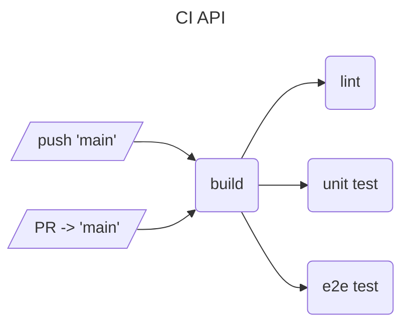

# DevOps - Group 08 [](https://github.com/ruegerj/devops/actions/workflows/sync-docs.yaml)

Members:

* Andreas Affentranger
* Jan Rüger
* Laurin Scholtysik
* Mirco Stadelmann

VMs:

* devops-bastion (83.228.209.199)
* srv-001.devops.ls.eee.intern
* srv-019.devops.ls.eee.intern
* srv-022.devops.ls.eee.intern
* srv-023.devops.ls.eee.intern

## Table of contents

- [Project Idea & Tools](#project-idead--tools)
- [Prerequisites & Setup](#prerequisites--setup)
  - [Local Workspace](#local-workspace)
- [Applications](#applications)
  - [REST API](#rest-api)
  - [Web Frontend](#web-frontend)
- [Pipelines](#pipelines)
  - [Continous Integration - API](#continous-integration---api)
  - [Continous Integration - Web](#continous-integration---web)
- [Miscellaneous](#miscellaneous)
  - [GitLab Docs Sync](#gitlab-docs-sync)


## Project Idea & Tools

**Application**

Dummy app that displays some information fetched from a private REST api.

- [X] Frontend - SvelteKit
- [X] Backend - Go REST API
- [ ] (Database - PostgreSQL) optional as extension

**DevOps Features**

- [ ] CI Pipeline (GitHub Actions)
    - [X] Build
    - [X] Lint
    - [X] Test
    - [ ] Static Code Analysis (Snyk?)

- [ ] CD Pipeline (Github Actions)
    - [X] Build
    - [X] Docker Image Build
    - [X] Image Push (GitHub Container Registry)
    - [ ] (ArgoCD Sync)

- [X] K8S or K3S Hosting
- [X] ArgoCD for Deployments
- [ ] Credential Vault (Hashicorp Vault?)
- [X] SSH Reverse Tunnel
- [X] Configuration as Code (TerraForm + Ansible?) -> Desaster Recovery

**Extensions**

- [ ] New feature with toggle (feature flag)
- [ ] Database with automated backup
- [ ] Database with schema change

## Prerequisites & Setup

### Local Workspace

In order work on this repo locally, one needs the following tools:

- [Go](https://go.dev/) (v1.25)
- [golangci-lint](https://golangci-lint.run/) (>= v2.5.0)
- [Task](taskfile.dev) (v3)
- [Docker](https://www.docker.com/)
- [pnpm](https://pnpm.io/) (v10.x)
- [ansible](https://docs.ansible.com/)
- [ansible-lint](https://ansible.readthedocs.io/projects/lint/installing/#installing-the-latest-version) (python3 and pip required)

Recommended but not mandatory:

- [act](https://github.com/nektos/act)
- [openssl](https://openssl-library.org/) (if you want to generate JWTs by hand)
- [Vagrant](https://developer.hashicorp.com/vagrant)
- [libvirt](https://libvirt.org/) (Presume you alread have a virtualization platform like QEMU)

For starting the application locally, testing, linting, or any other automations [Task](taskfile.dev) is used as a modern cross-platform Make
alternative. You can run task cmd's either in the repository root or in the dedicated subdirectories of the applications:

```bash
# start the api (cwd: ./)
task api:run

# start the api (cwd: ./api)
task run

# use: task --list-all for discovery of other cmd's
```

> All commands are written with unix systems in mind (Linux & Mac). If you are on Windows - try using a WSL instance if you are facing issues.
### Docker Containers

The release pipeline will build, tag and push two docker images to the GitHub Container Registry. One for the Backend and one for the frontend.   
During the build process the JWT_KEY and matching ACCESS_TOKEN are injected as build arguments into the respective docker images.

Note: JWT_KEY is defined as a github secret.

**Running the containers**   
- Backend  
  - Forward port 3000 to the host system.
- Frontend
  - Forward port 4173 to the host system.
  - Set API_BASE_URL to the backend URL (http://host.docker.internal:3000)
  - Note: http://localhost:3000 does not work as with this the container uses its INTERNAL localhost


You can run the containers with the following commands after loggin into ghcr.io with username and token:
```bash
docker pull ghcr.io/ruegerj/devops/api:latest
docker pull ghcr.io/ruegerj/devops/web:latest

docker run -d --name frontend -e API_BASE_URL=http://host.docker.internal:3000 -p 4173:4173 ghcr.io/ruegerj/devops/web:latest
docker run -d --name backend -p 3000:3000 ghcr.io/ruegerj/devops/api:latest
```

## Applications

The following diagram gives a brief overview on the application architecture. For more details see the corresponding sub sections.


### REST API

The REST API is written in Go. It features one main endpoint holding a "secret" value which can only be accessed when authenticated.

**Configuration:**

All configuration options are supplied as environment variables. When running the app locally via _Task_, they are automatically
supplied from the `.env` file. One for development purposes can be generated using the following command:

```bash
task generate:env
```

The following variables need to be set for the app to function properly:

| Key     | Description                                                       | Default value (Docker) |
| ------- | ----------------------------------------------------------------- | ---------------------- |
| HOST    | holds the hostname which the server listens on                    | 0.0.0.0                |
| PORT    | holds the TCP port number the server listens on                   | 3000                   |
| JWT_KEY | holds the symmetric signing key used to verify the JWT signatures | _none_                 |

**Endpoints:**

- `GET /health` - Indicates if the application is up and running
  - Authentication: _none_
  - Sample response:
    ```json
    {
      "status": "healthy",
      "timestamp": 1759777840
    }
    ```
- `GET /api/secret` - Holds secret value, only to be accessed by authenticated requests
  - Authentication: _Bearer token_ (JWT, HS256 symmetrically signed)
  - Sample request:
    ```bash
    curl --request GET \
      --url http://localhost:3000/api/secret \
      --header 'authorization: Bearer <jwt>'
    ```
  - Sample response:
    ```json
    {
      "message":"Some text",
      "number": 27
    }
    ```

**Tests:**

Most of the app's code is tested using unit tests. They live right next to their implementation in `x_test.go` files and are usually scoped in
their own testing module.

End-to-end (e2e) tests are located under _tests/e2e_. Before they are executed, the complete app is bootstrapped as [testcontainer](https://testcontainers.com/).
To be able to distinguish these tests from the unit tests, they must have the [build tag](https://pkg.go.dev/go/build#hdr-Build_Constraints) `e2e`.

In order to run the tests locally, use the following commands:

```bash
task test # both unit & e2e
task test:unit # unit tests only
task test:e2e # e2e tests only
```

### Web Frontend

The frontend is built using [SvelteKit](https://svelte.dev/docs/kit/introduction) as meta framework. It renders the UI and makes
authenticated calls to the [REST Api](#rest-api) in order to fetch data.

**Configuration:**

All configuration options are supplied as environment variables. When running the app locally, they are automatically supplied from
the `.env` file. One for development purposes can be generated using the following command:

```bash
task generate:env
```

> Note: the `.env` file of the api must already be present before running the command above

The following variables need to be set for the app to function properly:

| Key          | Description                                                        | Default value (Docker) |
| ------------ | ------------------------------------------------------------------ | ---------------------- |
| NODE_ENV     | holds the environment type the server should run in                | production             |
| ORIGIN       | holds the URL the application should listen on                     | http://localhost:4173  |
| PORT         | holds the TCP port number the server listens on                    | 4173                   |
| API_BASE_URL | holds the base url pointing to the api instance                    | _none_                 |
| ACCESS_TOKEN | holds the JWT access token used for authentication against the api | _none_                 |

**Endpoints:**

- `GET /api/secret` - Proxy for the same endpoint provided by the api (request will be enriched with private access token)
  - Authentication: _none_
  - Sample request:
    ```bash
    curl --request GET \
      --url http://localhost:5173/api/secret
    ```
  - Sample response: see [API > _Endoints_](#rest-api)

**Routes:**

- `/` - Displays the UI of the application
  - Authentication: _none_

**Tests:**

The app's code is tested using unit tests on component level. However due to the very limited functionality which is located in
the frontend their amount is very limited. In the case that project grows the testing infrastructure ([vitest](https://vitest.dev/)
) can be built uppon and extended with additional tests.

End-to-end (e2e) tests can be found in the _e2e_ directory. Here [Playwright](https://playwright.dev/) is used to test the actual
site for multiple headless browsers. In order to test all functionality, a complete api instance gets spun up using a
[testcontainer](https://testcontainers.com/).

In order to run the tests locally, use the following commands:

```bash
task test # both unit & e2e
task test:unit # unit tests only
task test:e2e # e2e tests only
```

> Before you execute e2e tests for the first time, make sure to run this command:
> ```bash
> pnpm dlx playwright install
> ```

## Pipelines

### Continous Integration - API



The pipeline runs for every _push_ and _pull request_ targeting the `main` branch, which is holding changes in the `api`
directory. It features the following steps:

- **build** - Builds the entire codebase in order to find any compilation errors.
- **lint** - Statically checks the codebase for potential quality flaws using [golangci-lint](https://golangci-lint.run/)
- **unit test** - runs all unit tests
- **e2e test** - runs all e2e tests against a testcontainer instance of the app (see _Tests_ section of [API](#rest-api))

### Continous Integration - Web


The pipeline runs for every _push_ and _pull request_ targeting the `main` branch, which is holding changes in the `web`
directory. It features the following steps:

- **build** - Builds the entire codebase in order to find any compilation errors.
- **lint** - Statically checks the codebase for potential quality flaws using [eslint](https://golangci-lint.run/) & SvelteKit
linter. Additionaly it checks the format of every file using [prettier](https://prettier.io/).
- **unit test** - runs all unit tests using [vitest](https://vitest.dev)
- **e2e test** - runs all e2e tests using [Playwright](https://playwright.dev/) (see _Tests_ section of [Web](#web-frontent))

### Continous Integration - Infrastructure

## Infrastructure
The following diagram gives a brief overview of the infrastructure setup the application is running on:

```mermaid
---
title: Infrastructure overview
----
architecture-beta
    group k3s(server)[K3s cluster]

    service srv001(server)[HAProxy]
    service srv019(server)[node01] in k3s
    service srv022(server)[node02] in k3s
    service srv023(server)[node03] in k3s

    junction junctionCenter

    srv001:R -- L:junctionCenter
    srv019:B -- T:junctionCenter
    srv022:T -- B:junctionCenter
    srv023:L -- R:junctionCenter
```

At the heart of the environment is a three node K3s cluster configured in a High Availability (HA) setup via [etcd](https://etcd.io/). It's resposible for hosting the application and all supporting services. For ingress the cluster uses a combination of ServiceLB and [Traefik](https://traefik.io/traefik). Entrypoints to both, the K3s API and Ingress controller are exposed as a single IP via  a [HAProxy](https://www.haproxy.org/) loadbalancer infront of the cluster.

> Note: In a ideal world atleast two loadbalancer e.g. HAProxy would be deployed in a HA setup, preventing the introduction of a new Single Point of failure (SPF). Another approach would be to use on cluster services like [MetalLB](https://metallb.io/installation/) and [kube-vip](https://kube-vip.io/) to introduce floating IPs and thus eliminating SPFs. In order to keep the infrastructure relatively simple and rather focusing on a broader set of devops topics, it was decided that in this particular case, having a single node loadbalancer at the expense of introducing a new SPF is acceptable.

### Network Access for Github Actions
In order to allow access to the Enterprise Lab VMs from the GitHub Action pipelines without the need of Pulse Secure VPN, a SSH reverse tunnel from `srv-001-devops.ls.eee.intern` to a bastion host (`devops-bastion`) located at a public cloud provider was estabilished.


### Automated infrastructure deployment via Ansible
Students were given four plain debian 12 (bookworm) VMs to deploy there infrastructure.
In order to prepare the infrastructure needed [Ansible](https://docs.ansible.com/) was used as a Infrastructure as Code (IaC) tool, enabeling fast and declarative provisioning aswell as rebuilding capabilities in case of a Disaster Recovery (DR) scenario. 
The diagram below gives quick overview of the playbook used for provisioning:

```
---
title: Ansible overview
---
flowchart TD
    staging_inventory[staging.yml]
    production_inventory[production.yml]
    site[/site.yml/]
    k3s-ansible[/k3s-ansible.yml/]
    argocd(argocd)
    haproxy(haproxy)
    kube_tools(kube_tools)


    staging_inventory --> site
    production_inventory --> site
    site --> haproxy
    site --> k3s-ansible
    site --> kube_tools
    site --> argocd

```

- **staging.yml** - inventory for staging environment
- **production.yml** - inventory for production environment
- **site.yml** - main playbook orchestrating the provisioning
- **haproxy** - role responsible for installing and configuring haproxy
- **k3s-ansible** - imported playbook from [k3s-ansible](https://github.com/k3s-io/k3s-ansible) responsible for provisioning the K3s HA cluster
- **kube_tools** - role for setting up [kubectl](https://kubernetes.io/docs/reference/kubectl/), [helm](https://helm.sh/) aswell as the needed Python libraries for ansible to interact with the K3s cluster
- **argocd** - role for deploying [argo-cd](https://argo-cd.readthedocs.io/en/stable/) to the K3s cluster

### Workload deployment via ArgoCD
After initial infrastructure setup via Ansible, ArgoCD is used inorder to deploy K3s cluster workloads.
lorem ipsum

**Testing of Ansible Playbooks:**
On pushing to `main` or creating a `pull request` all Ansible playbooks are checked for syntactical correctness in the `Lint Ansible` stage. For e2e testing of the playbooks the `Vagrant` file in the infrastructure root provides a set of VMs which can be started with `vagrant up`. The IPs of these VMs are set in the `inventory.dev.yml` file, therefore any playbook can be tested against this set of VMs.

## Miscellaneous

### GitLab Docs Sync

The main entry point for the course & grading is a repository hosted on the [Switch GitLab](https://gitlab.switch.ch/hslu/edu/bachelor-computer-science/devops/25hs01/g08/g08-documentation/).
As a fancy way to be able to view the documentation still in the GitLab repository, a GitHub Actions [workflow](/.github/workflows/sync-docs.yaml)
was created in order to syn  the contents of this file to the GitLab repo.

**Limitations:**

 - only the single file `DOCUMENTATION.md` is supported -> no support for standalone artifacts (e.g. images)
 - it uses a GitLab repository access token with a hard expiration date -> has to be checked and renewed manually (see [here](https://gitlab.switch.ch/hslu/edu/bachelor-computer-science/devops/25hs01/g08/g08-documentation/-/settings/access_tokens))
 - this workflow is _not_ concurrency safe (when multiple actions run concurrently the last to run wins) -> could lead to an incorrect state of the
 GitLab docs

**Considerations:**

The GitLab access token must have the scope `api` with the role _Maintainer_ in order to be able to update files on the `main` branch.
Thus the token grants one full permissions on most of the sensitive actions of the repository, which could lead to unpleasant outcomes when its
leaked. However since this token is on the repository-level and the GitLab documentation repository is not the source of truth (e.g. doesn't hold
any information which may be lost) it is considered an acceptable risk.

**Implementation:**

At it's core it simply uses the [Update File endpoint](https://docs.gitlab.com/api/repository_files/#update-existing-file-in-repository) of the
GitLab REST API.

- it runs on any commit on the `main` branch which alters the file `DOCUMENTATION.md`
- [jq](https://jqlang.org/) is used to construct the JSON body for the file update request
- the GitLab _project-id_ & _access-token_ are stored as Action Variable or Secret respectively
- [cURL](https://curl.se/) is used to perform the HTTP request to the GitLab API
